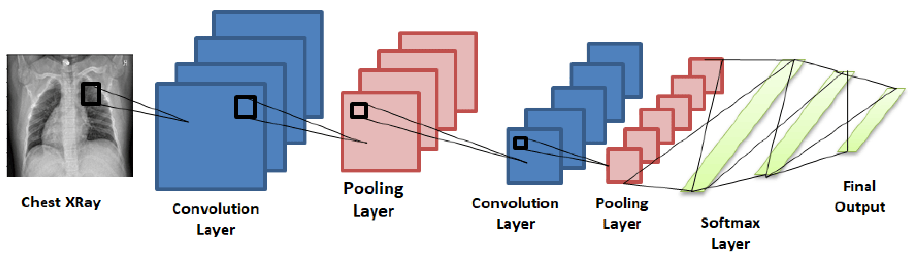

# Pneumonia-Detection-using-Convolutional-neural-network-and-Transfer-learning

"Pneumonia Detection using Convolutional Neural Network and Transfer Learning is an innovative project leveraging advanced machine learning techniques. This initiative employs convolutional neural networks and transfer learning to enhance the accuracy of pneumonia detection from medical images, showcasing the potential of AI in healthcare diagnostics."

## Features

- CNN and transfer learning applied for pneumonia detection.
- Real-time processing of medical images for timely diagnostics.
- Visual representation with overlays for enhanced interpretation.
- User-friendly interface for easy interaction with the detection system.
- Detailed diagnostic reports with probability scores and visual heatmaps.
## Requirements

- Python 3.x for project development.
- Essential Python packages: tensorflow, keras, opencv-python, numpy for image processing.

## Architecture Diagram



## Flow chart


## Installation

1. Clone the repository:

   ```shell
   git clone https://github.com/Paul-Andrew-15/Pneumonia-Detection-using-Convolutional-neural-network-and-Transfer-learning-Resnet50-.git

2. Install the required packages:

3. Download the pre-trained pneumonia detection model and label mappings.

## Usage

1. Open a new Google Colab notebook.

2. Upload the project files in Google Drive.

3. Load the pre-trained pneumonia detection model and label mappings. Ensure the model files are correctly placed in the Colab working directory.

4. Execute the Pneumonia Detection script in the Colab notebook, which may involve adapting the script to run within a notebook environment.

5. Follow the on-screen instructions or customize input cells in the notebook for pneumonia detection with uploaded medical images.

6. View and analyze the results directly within the Colab notebook.

7. Repeat the process for additional images or iterations as needed.

## Program:

```python
from google.colab import drive
drive.mount('/content/drive')

import os
import numpy as np
import pandas as pd
import matplotlib.pyplot as plt
import seaborn as sns
import tensorflow as tf
from tensorflow import keras
from PIL import Image
from tensorflow.keras.applications import ResNet50
from tensorflow.keras.models import Sequential, load_model
from tensorflow.keras.layers import Dense, Flatten, GlobalAveragePooling2D
from tensorflow.keras.preprocessing.image import ImageDataGenerator
from tensorflow.keras.callbacks import ModelCheckpoint, EarlyStopping, LearningRateScheduler
from tensorflow.keras import utils

os.listdir('/content/drive/MyDrive/pneumonia')

len(os.listdir(('/content/drive/MyDrive/pneumonia/train/PNEUMONIA')))

train_dir = '/content/drive/MyDrive/pneumonia/train'
test_dir = '/content/drive/MyDrive/pneumonia/test'
val_dir = '/content/drive/MyDrive/pneumonia/val'

print("Train set:\n========================================")
num_pneumonia = len(os.listdir(os.path.join(train_dir, 'PNEUMONIA')))
num_normal = len(os.listdir(os.path.join(train_dir, 'NORMAL')))
print(f"PNEUMONIA={num_pneumonia}")
print(f"NORMAL={num_normal}")

print("Test set:\n========================================")
print(f"PNEUMONIA={len(os.listdir(os.path.join(test_dir, 'PNEUMONIA')))}")
print(f"NORMAL={len(os.listdir(os.path.join(test_dir, 'NORMAL')))}")

print("Validation set:\n========================================")
print(f"PNEUMONIA={len(os.listdir(os.path.join(val_dir, 'PNEUMONIA')))}")
print(f"NORMAL={len(os.listdir(os.path.join(val_dir, 'NORMAL')))}")

pneumonia = os.listdir('/content/drive/MyDrive/pneumonia/train/PNEUMONIA')
pneumonia_dir = '/content/drive/MyDrive/pneumonia/train/PNEUMONIA'

image_files = [file for file in os.listdir(pneumonia_dir) if file.lower().endswith(('.png', '.jpg', '.jpeg', '.gif', '.bmp', '.tiff'))]

for i in range(9):
    plt.subplot(3, 3, i + 1)
    img = plt.imread(os.path.join(pneumonia_dir, image_files[i]))
    plt.imshow(img, cmap='gray')
    plt.axis('off')

plt.show()

normal = os.listdir('/content/drive/MyDrive/pneumonia/train/NORMAL')
normal_dir = '/content/drive/MyDrive/pneumonia/train/NORMAL'

plt.figure(figsize=(20, 10))

for i in range(9):
    plt.subplot(3, 3, i + 1)
    img = plt.imread(os.path.join(normal_dir, normal[i]))
    plt.imshow(img, cmap='gray')
    plt.axis('off')

plt.tight_layout()

normal_img = os.listdir(('/content/drive/MyDrive/pneumonia/train/NORMAL'))[0]
normal_dir = '/content/drive/MyDrive/pneumonia/train/NORMAL'
sample_img = plt.imread(os.path.join(normal_dir, normal_img))
plt.imshow(sample_img, cmap='gray')
plt.colorbar()
plt.title('Raw Chest X Ray Image')

print(f"The dimensions of the image are {sample_img.shape[0]} pixels width and {sample_img.shape[1]} pixels height, one single color channel.")
print(f"The maximum pixel value is {sample_img.max():.4f} and the minimum is {sample_img.min():.4f}")
print(f"The mean value of the pixels is {sample_img.mean():.4f} and the standard deviation is {sample_img.std():.4f}")

sns.distplot(sample_img.ravel(),
            label=f"Pixel Mean {np.mean(sample_img):.4f} & Standard Deviation {np.std(sample_img):.4f}", kde=False)
plt.legend(loc='upper center')
plt.title('Distribution of Pixel Intensities in the Image')
plt.xlabel('Pixel Intensity')
plt.ylabel('# Pixels in Image')

from keras.preprocessing.image import ImageDataGenerator

image_generator = ImageDataGenerator(
    rotation_range=20,
    width_shift_range=0.1,
    shear_range=0.1,
    zoom_range=0.1,
    samplewise_center=True,
    samplewise_std_normalization=True
)

train = image_generator.flow_from_directory(train_dir,
                                            batch_size=8,
                                            shuffle=True,
                                            class_mode='binary',
                                            target_size=(180, 180))

validation = image_generator.flow_from_directory(val_dir,
                                                batch_size=1,
                                                shuffle=False,
                                                class_mode='binary',
                                                target_size=(180, 180))

test = image_generator.flow_from_directory(test_dir,
                                            batch_size=1,
                                            shuffle=False,
                                            class_mode='binary',
                                            target_size=(180, 180))

sns.set_style('white')
generated_image, label = train.__getitem__(0)
plt.imshow(generated_image[0], cmap='gray')
plt.colorbar()
plt.title('Raw Chest X Ray Image')

print(f"The dimensions of the image are {generated_image.shape[1]} pixels width and {generated_image.shape[2]} pixels height, one single color channel.")
print(f"The maximum pixel value is {generated_image.max():.4f} and the minimum is {generated_image.min():.4f}")
print(f"The mean value of the pixels is {generated_image.mean():.4f} and the standard deviation is {generated_image.std():.4f}")

sns.distplot(generated_image.ravel(),
            label=f"Pixel Mean {np.mean(generated_image):.4f} & Standard Deviation {np.std(generated_image):.4f}", kde=False)
plt.legend(loc='upper center')
plt.title('Distribution of Pixel Intensities in the Image')
plt.xlabel('Pixel Intensity')
plt.ylabel('# Pixels in Image')

weight_for_0 = num_pneumonia / (num_normal + num_pneumonia)
weight_for_1 = num_normal / (num_normal + num_pneumonia)

class_weight = {0: weight_for_0, 1: weight_for_1}

print(f"Weight for class 0: {weight_for_0:.2f}")
print(f"Weight for class 1: {weight_for_1:.2f}")

from keras.applications import ResNet50

resnet_base_model = ResNet50(input_shape=(180,180,3), include_top=False, weights='imagenet')

resnet_base_model.summary()

from keras.layers import Dense, GlobalAveragePooling2D
from keras.models import Model
from keras import backend as K
from keras.models import Sequential
from keras.layers import Dense, Conv2D, MaxPool2D, Dropout, Flatten, BatchNormalization

    resnet_model = tf.keras.Sequential([
        resnet_base_model,
        GlobalAveragePooling2D(),
        Dense(512, activation="relu"),
        BatchNormalization(),
        Dropout(0.6),
        Dense(128, activation="relu"),
        BatchNormalization(),
        Dropout(0.4),
        Dense(64,activation="relu"),
        BatchNormalization(),
        Dropout(0.3),
        Dense(1,activation="sigmoid")
    ])

    opt = tf.keras.optimizers.Adam(learning_rate=0.001)
    METRICS = [
        'accuracy',
        tf.keras.metrics.Precision(name='precision'),
        tf.keras.metrics.Recall(name='recall')
    ]
    resnet_model.compile(optimizer=opt,loss='binary_crossentropy',metrics=METRICS)

    r = resnet_model.fit(train,
          epochs=50,
          validation_data=validation,
          class_weight=class_weight,
          steps_per_epoch=100,
          validation_steps=25)

          plt.figure(figsize=(12, 8))

plt.subplot(2, 2, 1)
plt.plot(r.history['loss'], label='Loss')
plt.plot(r.history['val_loss'], label='Val_Loss')
plt.legend()
plt.title('Loss Evolution')

plt.subplot(2, 2, 2)
plt.plot(r.history['accuracy'], label='Accuracy')
plt.plot(r.history['val_accuracy'], label='Val_Accuracy')
plt.legend()
plt.title('Accuracy Evolution')

evaluation =resnet_model.evaluate(test)
print(f"Test Accuracy: {evaluation[1] * 100:.2f}%")

evaluation = resnet_model.evaluate(train)
print(f"Train Accuracy: {evaluation[1] * 100:.2f}%")

predicted_vals = resnet_model.predict(test, steps=len(test))

from sklearn.metrics import confusion_matrix, classification_report
print(confusion_matrix(test.classes, predicted_vals > 0.5))
pd.DataFrame(classification_report(test.classes, predicted_vals > 0.5, output_dict=True))

```
## Output:

### Training log:


### Model evaluation metrics:


### Confusion matrix:


### Classification report:


## Result:

The pneumonia detection model, utilizing CNN and transfer learning with ResNet50, demonstrates strong performance on both training and testing datasets:

- The model achieved an accuracy of 89.26% on the test dataset, showcasing its ability to correctly classify pneumonia cases.
- During training, the model reached a high accuracy of 96.05% on the training dataset, indicating effective learning and generalization.
- Precision, measuring the model's ability to correctly identify positive cases, is notably high at 96.79%.

These results suggest that the pneumonia detection model is both accurate and well-balanced, with high precision and recall values. Further analysis, including the examination of the confusion matrix and visualizations provide additional insights into the model's performance.


